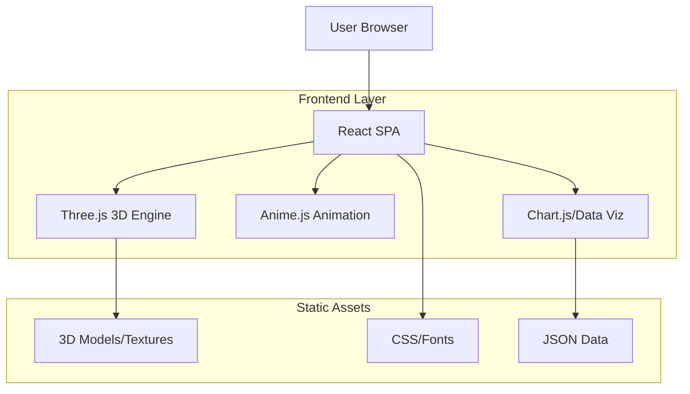
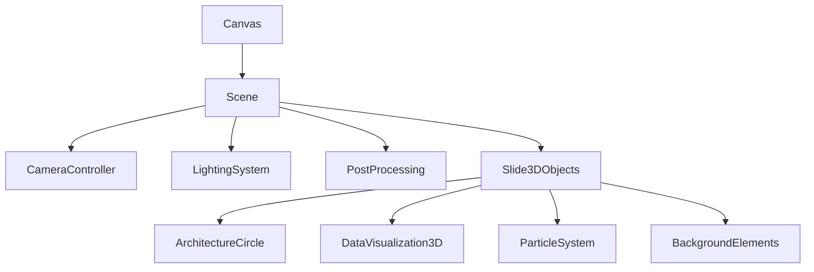

## 1. 架构设计



## 2. 技术描述

- **前端框架**：React@18 + TypeScript@5 + Vite@5
- **样式方案**：TailwindCSS@3 + 自定义CSS变量
- **3D渲染**：Three.js@0.160 + @react-three/fiber@8 + @react-three/drei@9
- **动画库**：Anime.js@3 + Framer-motion@11
- **数据可视化**：Chart.js@4 + react-chartjs-2@5
- **初始化工具**：vite-init
- **后端**：无（纯静态SPA）

## 3. 路由定义

| 路由 | 用途 |
|------|------|
| / | 主演示页面，包含所有演讲内容 |
| /slide/:id | 特定幻灯片片段（可选，用于直接跳转） |

## 4. 组件架构

### 4.1 核心组件类型定义

页面状态管理
```typescript
interface PresentationState {
  currentSlide: number;
  totalSlides: number;
  isAnimating: boolean;
  slideData: SlideData[];
}

interface SlideData {
  id: number;
  type: 'intro' | 'data-viz' | 'architecture' | 'features' | 'summary';
  title: string;
  content: any;
  animationConfig: AnimationConfig;
}
```

3D场景配置
```typescript
interface Scene3DConfig {
  camera: {
    position: [number, number, number];
    fov: number;
    near: number;
    far: number;
  };
  lighting: {
    ambient: { color: string; intensity: number };
    directional: { color: string; intensity: number; position: [number, number, number] };
    point: { color: string; intensity: number; position: [number, number, number] }[];
  };
  postprocessing: {
    bloom: { strength: number; radius: number; threshold: number };
    ssao: { enabled: boolean; radius: number; intensity: number };
  };
}
```

### 4.2 主要组件结构

```typescript
// 主应用组件
App.tsx
├── PresentationContainer.tsx
│   ├── SlideNavigation.tsx
│   ├── Scene3DManager.tsx
│   └── SlideContentRenderer.tsx
│       ├── IntroSlide.tsx
│       ├── DataVisualizationSlide.tsx
│       ├── ArchitectureSlide.tsx
│       ├── FeaturesSlide.tsx
│       └── SummarySlide.tsx
├── AnimationController.tsx
└── AssetLoader.tsx
```

## 5. 3D场景架构

### 5.1 场景组件层次


### 5.2 性能优化策略
- **LOD系统**：根据物体距离使用不同细节级别的模型
- **实例化渲染**：对重复3D元素使用InstancedMesh
- **纹理压缩**：使用KTX2格式纹理，减少GPU内存占用
- **动画优化**：使用GPU粒子系统，减少CPU计算负担

## 6. 动画系统

### 6.1 动画类型配置
```typescript
interface AnimationPresets {
  slideTransition: {
    duration: number;
    easing: string;
    properties: {
      opacity: [number, number];
      transform: { translateX?: number; scale?: number; rotation?: number };
    };
  };
  elementEntrance: {
    stagger: number;
    properties: {
      opacity: [number, number];
      translateY: [number, number];
      scale: [number, number];
    };
  };
  textReveal: {
    type: 'char' | 'word' | 'line';
    duration: number;
    delay: number;
  };
}
```

### 6.2 动画序列管理
- 使用Anime.js的时间线功能管理复杂动画序列
- 实现动画状态机，确保动画状态一致性
- 支持动画中断和恢复，提升用户体验

## 7. 数据管理

### 7.1 静态数据结构
```typescript
// 金融数据格式
interface FinancialData {
  fundingRate: {
    timestamps: number[];
    values: number[];
    rollingSum: number[];
    rollingMean: number[];
    rollingStd: number[];
    positiveRatio: number[];
  };
  histogramData: {
    pre2026: { bins: number[]; counts: number[] };
    post2026: { bins: number[]; counts: number[] };
  };
}

// 系统特性数据
interface SystemFeatures {
  dataManagement: string[];
  strategyManagement: string[];
  riskControl: string[];
  operations: string[];
  portfolio: string[];
  execution: string[];
}
```

### 7.2 资源加载策略
- 使用Vite的静态资源处理，支持图片、3D模型、字体等
- 实现渐进式加载，优先加载首屏必需资源
- 使用Web Workers处理大数据集，避免阻塞主线程

## 8. 构建配置

### 8.1 Vite配置要点
```typescript
// vite.config.ts
export default defineConfig({
  base: './',
  build: {
    target: 'es2020',
    rollupOptions: {
      output: {
        manualChunks: {
          'three': ['three', '@react-three/fiber', '@react-three/drei'],
          'animation': ['animejs', 'framer-motion'],
          'charts': ['chart.js', 'react-chartjs-2']
        }
      }
    }
  },
  optimizeDeps: {
    include: ['three', 'animejs', 'chart.js']
  }
})
```

### 8.2 部署配置
- 构建输出为纯静态文件，支持任何静态文件服务器
- 配置正确的MIME类型支持.glb、.gltf等3D文件格式
- 启用Gzip压缩，减少传输体积