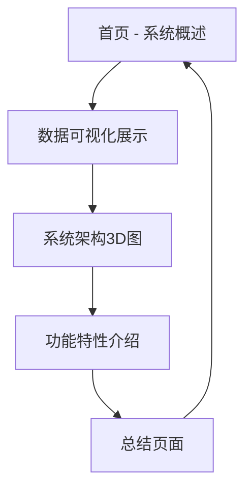

## 1. 产品概述

这是一个专为演讲设计的单页面应用，采用12:3带鱼屏比例，提供类似PPT的翻页体验。应用将展示机构级数字资产管理系统的核心功能和数据可视化内容，通过Three.js和Anime.js实现震撼的3D效果和流畅动画。

目标用户为金融机构、投资团队和演讲者，用于展示复杂的金融数据和系统架构，提升演讲的视觉冲击力和专业度。

## 2. 核心功能

### 2.1 用户角色
| 角色 | 注册方式 | 核心权限 |
|------|----------|----------|
| 演讲者 | 无需注册 | 控制翻页、查看所有内容 |
| 观众 | 无需注册 | 被动观看演讲内容 |

### 2.2 功能模块
演示应用包含以下主要页面：
1. **主演示页面**：包含多个演讲板块，支持点击翻页
2. **系统架构展示**：3D圆形系统图展示
3. **数据可视化**：金融数据图表展示
4. **功能特性页**：系统核心功能介绍

### 2.3 页面详情
| 页面名称 | 模块名称 | 功能描述 |
|----------|----------|----------|
| 主演示页面 | 页面导航系统 | 鼠标左键点击切换下一页，支持循环播放 |
| 主演示页面 | 3D场景渲染 | 使用Three.js渲染震撼的3D背景和元素 |
| 主演示页面 | 动画效果 | Anime.js实现的页面切换动画和元素动效 |
| 系统架构展示 | 圆形系统图 | 中心FT标识，外围6个系统模块的3D环形布局 |
| 数据可视化 | 金融图表 | 展示BINANCE ETHUSDT资金费率数据的2x2图表网格 |
| 功能特性页 | 特性列表 | 左右分栏展示系统6大核心功能特性 |

## 3. 核心流程

演讲者操作流程：
1. 打开应用进入全屏演示模式
2. 应用自动展示第一页内容
3. 演讲者通过鼠标左键点击切换下一页
4. 每页都有独特的3D动画和视觉效果
5. 支持循环播放，最后一页点击后回到首页

## 4. 用户界面设计

### 4.1 设计风格
- **主色调**：深紫色(#1a0033)到黑色(#000000)渐变背景
- **辅助色**：霓虹绿(#00ff88)、亮紫色(#cc00ff)、白色(#ffffff)
- **字体**：无衬线字体，标题加粗，正文常规
- **按钮样式**：扁平化设计，hover时发光效果
- **布局风格**：全屏沉浸式，内容居中展示

### 4.2 页面设计概述
| 页面名称 | 模块名称 | UI元素 |
|----------|----------|--------|
| 首页 | 标题区域 | 大字体白色标题"機構級智能高效的數字資產管理系統"，居中显示 |
| 数据页 | 图表网格 | 2x2布局的4个金融图表，白底黑字，彩色线条 |
| 架构页 | 3D圆形图 | 中心FT标识，6个紫色扇形区域环绕，白色文字标签 |
| 特性页 | 分栏布局 | 左右两列，每列3个特性点，白色文字，紫色图标 |

### 4.3 响应式设计
- **设计原则**：桌面优先，专为12:3带鱼屏优化
- **适配策略**：固定12:3比例，不支持移动端适配
- **交互优化**：仅支持鼠标点击，无触摸交互

### 4.4 3D场景指导
- **环境设置**：深空HDRI环境贴图，营造深邃的太空感
- **光照系统**：
  - 主光源：紫色聚光灯，强度1.5，投射柔和阴影
  - 补光：蓝色环境光，强度0.3，填充暗部细节
  - 边缘光：绿色轮廓光，突出物体边缘
- **相机配置**：
  - FOV：60度，提供适中的透视感
  - 初始位置：(0, 0, 10)，俯视角度
  - 支持鼠标控制旋转和缩放
- **后期处理**：
  - Bloom泛光效果，增强发光元素
  - SSAO环境遮蔽，增加深度感
  - 色调映射，统一整体色彩风格